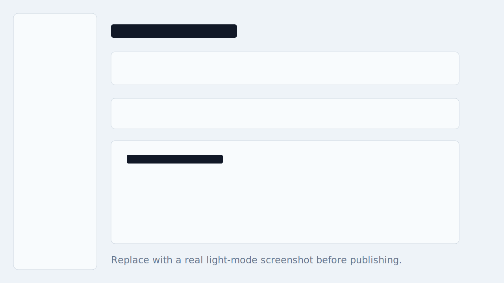
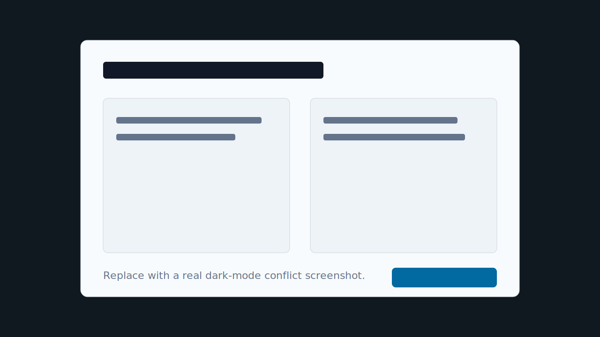
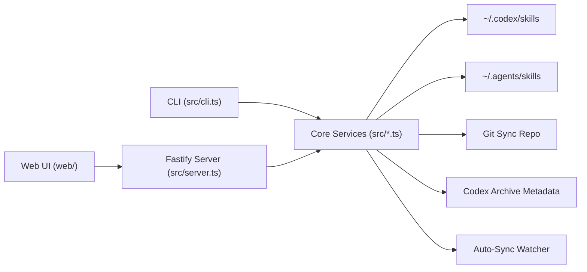

# Codex Skill Manager

[](./.github/workflows/ci.yml)
[](./LICENSE)
[](https://nodejs.org/)

Local-first CLI + Web manager for syncing Codex skills with Git across machines.

It focuses on safe, explicit operations between local skill directories and a dedicated sync repo, including Codex Archive workflows and auto-sync watching.

## Screenshots

> Placeholder images: replace these files with real captures from your environment.




## Quick Start

Prerequisites: Node.js `>=20`, Git, macOS (directory picker support is macOS-first).

```bash
yarn install
npm run dev -- init
npm run dev -- serve
```

Open `http://127.0.0.1:3017`.

Useful CLI commands:

```bash
npm run dev -- status
npm run dev -- pull
npm run dev -- sync <skill-id>
npm run dev -- update-local <skill-id>
npm run dev -- stop-syncing <skill-id>
```

Documentation site:

```bash
npm run docs:dev
npm run docs:build
```

## Architecture



Highlights:
- Git-backed sync for Codex/Agents skills
- Local manager for install/import/update/remove flows
- Codex Archive support for tracking and recoverability
- Auto-sync watching for managed skills
- macOS directory picker during setup
- Local-first: no remote SaaS dependency for core sync operations

## Project Structure

```text
codex-skill-manager/
├── src/                # CLI, sync, git, archive, watcher, server
├── web/                # local management UI
├── tests/              # vitest coverage
├── docs/               # screenshots, extra docs
├── .github/            # issue/PR templates and CI workflow
└── README.md
```

## FAQ / Troubleshooting

**Q: Why does first launch ask for a directory?**  
A: The app needs a dedicated Git sync repo. On macOS, the directory picker selects and stores this location locally.

**Q: I changed a skill, but nothing was pushed.**  
A: Check auto-sync watching status. If watching is disabled, run manual `sync`.

**Q: How do I avoid touching my real skill folders while testing?**  
A: Start with isolated env paths:

```bash
CSM_SYNC_REPO=/tmp/csm-sync \
CSM_CODEX_SKILLS_DIR=/tmp/csm-codex \
CSM_AGENTS_SKILLS_DIR=/tmp/csm-agents \
CSM_CONFIG_DIR=/tmp/csm-config \
CSM_CACHE_DIR=/tmp/csm-cache \
npm run dev -- serve
```

**Q: Port `3017` is occupied.**  
A: Start on another port:

```bash
npm run dev -- serve --port 4100
```

## Contributing

Please read:
- [CONTRIBUTING.md](./CONTRIBUTING.md)
- [CODE_OF_CONDUCT.md](./CODE_OF_CONDUCT.md)
- [SECURITY.md](./SECURITY.md)
- [CHANGELOG.md](./CHANGELOG.md)

Bug reports and feature requests are welcome in GitHub Issues.
